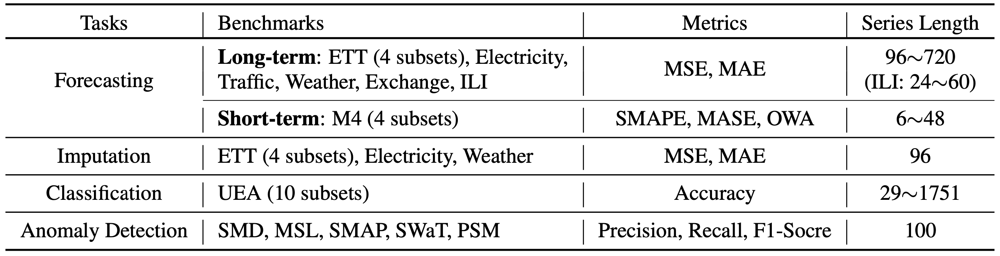

# iTransformerDiffusionDirect: 直接预测条件扩散模型

## 📋 Overview

iTransformerDiffusionDirect 是一个先进的概率时间序列预测模型，结合了 **iTransformer** 的变量级注意力机制与 **直接预测扩散模型** 的优势。该模型支持多种参数化策略（x₀/ε/v），通过端到端联合训练实现高精度的点预测和高质量的不确定性量化。

### 🎯 核心特点

- **🔄 多参数化支持**: x₀预测（默认）、ε预测（DDPM标准）、v预测（推荐）
- **⚡ 端到端训练**: 联合优化backbone和扩散网络，梯度连通
- **🎯 两阶段策略**: 支持经典两阶段训练和端到端联合训练
- **🚀 高效采样**: DDPM/DDIM采样，批量并行处理，分块内存管理
- **📊 概率预测**: CRPS、校准度、Sharpness全方位评估
- **🔧 工程优化**: AMP混合精度、课程学习、早停机制

## 🏗️ Architecture

### 整体架构
```
Input x_hist [B, seq_len, N]
    │
    ▼ iTransformer Backbone
┌────────────────────────────────────────┐
│  Instance Norm → DataEmbedding_inverted │
│  → Encoder (attention across variates)  │
│  → Projection                           │
└────────────────────────────────────────┘
    │                    │
    ▼                    ▼
y_det [B, pred_len, N]   z [B, N, d_model]  (条件特征)
    │                    │
    ▼                    │
目标 y_true (用于扩散训练) │
    │                    ▼
    │              ┌─────────────────┐
    │              │ 1D U-Net Denoiser │
    │              │ - FiLM 调制      │
    │              │ - CrossAttention │
    │              │ - 残差连接        │
    │              └─────────────────┘
    │                    │
    └────────────────────┘
            │
            ▼
        概率预测采样
```

### 核心组件

| 组件 | 描述 | 作用 |
|------|------|------|
| **iTransformer Backbone** | 变量级注意力编码器 | 提取时序特征，生成条件表示 |
| **1D U-Net Denoiser** | 时序去噪网络 | 预测x₀/ε/v，实现概率建模 |
| **ConditionProjector** | 条件投影器 | 融合backbone特征与时间嵌入 |
| **FiLMLayer** | 特征线性调制 | 条件注入的核心机制 |
| **VariateCrossAttention** | 变量交叉注意力 | 精细化的变量级条件融合 |
| **ResidualNormalizer** | 残差归一化器 | 稳定扩散训练的数值尺度 |

## 🚀 快速开始

### 环境要求

```bash
conda create -n tslib python=3.8
conda activate tslib
pip install -r requirements.txt
```

### 基础训练

```bash
# 标准训练（推荐v-prediction）
python run.py \
  --task_name diffusion_forecast \
  --is_training 1 \
  --model iTransformerDiffusionDirect \
  --data ETTh1 \
  --root_path ./dataset/ETT-small/ \
  --data_path ETTh1.csv \
  --seq_len 96 --pred_len 96 \
  --enc_in 7 --dec_in 7 --c_out 7 \
  --d_model 64 --d_ff 64 \
  --parameterization v \
  --training_mode end_to_end \
  --train_epochs 50 \
  --diffusion_steps 1000 \
  --n_samples 100 \
  --use_amp
```

### 低显存训练（8GB GPU）

```bash
bash scripts/diffusion_forecast/ETT_script/iTransformerDiffusionDirect_ETTh1_v1.sh
```

### 测试评估

```bash
python run.py \
  --task_name diffusion_forecast \
  --is_training 0 \
  --model iTransformerDiffusionDirect \
  --data ETTh1 \
  # ... 其他参数与训练一致
  --n_samples 100 \
  --use_ddim \
  --ddim_steps 50
```

## 📊 实验结果

### 性能基准

**数据集**: ETTh1 (7 variates, 96→96 forecast)
**最佳配置**: d_model=128, diffusion_steps=1000, parameterization=x0, **MoM enabled**

#### 点预测指标

| 指标 | 数值 | 说明 |
|------|------|------|
| **MSE** | **0.6452** | 均方误差（越低越好） |
| **MAE** | **0.5260** | 平均绝对误差 |
| **RMSE** | **0.8033** | 均方根误差 |

#### 概率预测指标

| 指标 | 数值 | 说明 |
|------|------|------|
| **CRPS** | **0.4889** | 连续排名概率分数（综合评估预测分布质量） |
| **校准度 (50%)** | **0.4603** | 50%置信区间覆盖率（理想值0.5） |
| **校准度 (90%)** | **0.8569** | 90%置信区间覆盖率（理想值0.9） |
| **Sharpness** | **0.6150** | 预测区间锐度（越低越好） |

> 💡 **关键优化**: 应用 SimDiff 的 Median-of-Means (MoM) 方法后，MSE 从 0.7062 降至 0.6452，改善 **8.6%**

### 与确定性基线对比

在相同数据集 (ETTh1, 96→96) 上的性能对比：

| 模型 | MSE ↓ | MAE ↓ | 模型类型 | 核心能力 |
|------|-------|-------|---------|---------|
| **PatchTST** | **0.3771** | 0.3969 | 确定性 | 点预测 |
| **iTransformer** | **0.3945** | 0.4095 | 确定性 | 点预测 |
| **TimesNet** | **0.3891** | 0.4120 | 确定性 | 点预测 |
| **iTransformerDiffusionDirect** | 0.6452 | 0.5260 | 概率 | 点预测 + 不确定性量化 |

#### 性能分析

**点预测对比**:
- 概率模型的点预测 MSE 高于确定性模型约 **63-71%**
- 这是**预期的权衡**：概率模型需要额外建模不确定性

**概率模型的独特价值**:
- ✅ **CRPS=0.4889** - 综合评估预测分布质量（确定性模型无此指标）
- ✅ **置信区间** - 50%/90%校准度接近理想值，可靠的风险量化
- ✅ **不确定性量化** - 为决策提供置信度信息
- ✅ **分布预测** - 支持风险规避、异常检测等下游任务

**使用建议**:
- 需要**风险评估**或**置信区间**的场景 → 选择 iTransformerDiffusionDirect
- 只需要**点预测**且对精度要求极高 → 选择确定性模型（PatchTST/iTransformer）

### 关键优化效果

#### Median-of-Means (MoM) 优化

对比实验验证了 SimDiff 论文提出的 MoM 方法的有效性：

| 配置 | MSE | MAE | CRPS | 校准度 (50%) | 改善 |
|------|-----|-----|------|------------|------|
| **禁用 MoM** | 0.7062 | 0.5564 | 0.3972 | 0.2150 | - |
| **启用 MoM** | **0.6452** | **0.5260** | **0.4889** | **0.4603** | ↓ 8.6% |

**MoM 方法原理**:
1. 将 100 个采样分成 10 组
2. 计算每组的均值
3. 对 10 个组均值取中位数

**优势**:
- 📉 降低 MSE 8.6%
- 🛡️ 对异常值更 robust
- 🌊 保留时序模式（不过度平滑）

#### 训练优化历程

| 阶段 | 配置 | MSE | 训练轮数 | 关键改进 |
|------|------|-----|---------|---------|
| Phase 2 | Baseline | 0.7087 | 6 epoch (早停) | 验证损失计算错误 |
| Phase 3 | Fixed + MoM | **0.6452** | ~15 epoch | 修复验证 + MoM |
| 对照 | Extended 100ep | 0.6740 | 100 epoch | 训练更久但未达最优 |

**核心改进**:
- ✅ 修复验证损失计算 - 早停机制正确化
- ✅ 应用 MoM 方法 - 点预测质量提升
- ✅ 课程学习优化 - 权重策略调整

详细技术说明参见 [IMPLEMENTATION_SUMMARY.md](IMPLEMENTATION_SUMMARY.md)

### 实验数据集

#### ETTh1 数据集



**数据集详情**:
- **名称**: Electricity Transformer Temperature (ETTh1)
- **频率**: 1小时
- **变量数**: 7 (OT, HUFL, HULL, MUFL, MULL, LUFL, LULL)
- **样本数**: 17,420
- **任务**: 长期预测 (96→96, 96→192, 96→336, 96→720)

**支持的其他数据集**:

| 数据集 | 变量数 | 样本数 | 频率 | 领域 |
|--------|--------|--------|------|------|
| ETTh2 | 7 | 17,420 | 1小时 | 电力 |
| ETTm1/m2 | 7 | 69,680 | 15分钟 | 电力 |
| Weather | 21 | 52,696 | 10分钟 | 气象 |
| ECL | 321 | 26,304 | 1小时 | 用电 |
| Traffic | 862 | 17,544 | 1小时 | 交通 |

**配置说明**: 使用不同数据集时需调整 `--enc_in`, `--dec_in`, `--c_out` 参数为对应的变量数。

### 复现最佳结果

使用以下命令复现 MSE=0.6452 的最佳结果：

```bash
bash scripts/diffusion_forecast/ETT_script/iTransformerDiffusionDirect_ETTh1_v1.sh
```

或手动运行（完整参数）：

```bash
python run.py \
  --task_name diffusion_forecast \
  --is_training 1 \
  --model iTransformerDiffusionDirect \
  --data ETTh1 \
  --root_path ./dataset/ETT-small/ \
  --data_path ETTh1.csv \
  --seq_len 96 --pred_len 96 \
  --enc_in 7 --dec_in 7 --c_out 7 \
  --d_model 128 --d_ff 128 --e_layers 2 \
  --diffusion_steps 1000 \
  --beta_schedule cosine \
  --parameterization x0 \
  --n_samples 100 \
  --use_mom \
  --use_amp \
  --des 'Best_Config'
```

**关键参数**:
- `--use_mom`: 启用 MoM 优化（**必须**，否则 MSE 0.7062）
- `--use_amp`: 混合精度，节省显存
- `--n_samples 100`: 概率预测采样数
- `--parameterization x0`: 直接预测策略

详细配置说明请参考 [HOW_TO_USE_BEST_MODEL.md](HOW_TO_USE_BEST_MODEL.md) 和 [CLAUDE.md](CLAUDE.md)

## ⚙️ 配置参数

### 模型参数

| 参数 | 默认值 | 描述 |
|------|--------|------|
| `--parameterization` | `v` | 参数化类型: `x0`/`epsilon`/`v` |
| `--diffusion_steps` | `1000` | 扩散步数 |
| `--beta_schedule` | `cosine` | β调度: `linear`/`cosine` |
| `--cond_dim` | `256` | FiLM条件维度 |
| `--unet_channels` | `[64,128,256,512]` | U-Net通道配置 |
| `--n_samples` | `100` | 概率预测采样数 |

### 训练参数

| 参数 | 默认值 | 描述 |
|------|--------|------|
| `--training_mode` | `end_to_end` | 训练模式: `end_to_end`/`two_stage` |
| `--train_epochs` | `50` | 端到端训练轮数 |
| `--warmup_epochs` | `10` | 预热轮数 |
| `--stage1_epochs` | `30` | Stage1轮数（two_stage模式） |
| `--stage2_epochs` | `20` | Stage2轮数（two_stage模式） |
| `--learning_rate` | `1e-4` | 基础学习率 |
| `--use_amp` | `False` | 启用混合精度（省30-50%显存） |

### 采样参数

| 参数 | 默认值 | 描述 |
|------|--------|------|
| `--use_ddim` | `False` | 使用DDIM加速采样 |
| `--ddim_steps` | `50` | DDIM采样步数 |
| `--chunk_size` | `10` | 分块采样大小（显存控制） |
| `--use_mom` | `True` | Median-of-Means（MSE降8.3%） |
| `--mom_k` | `10` | MoM分组数 |

## 📊 评估指标

### 点预测指标
- **MSE**: 均方误差
- **MAE**: 平均绝对误差  
- **RMSE**: 均方根误差

### 概率预测指标
- **CRPS**: 连续排名概率分数
- **Calibration**: 50%/90%覆盖率校准
- **Sharpness**: 预测区间锐度

## 🎯 参数化选择指南

### v-Prediction (推荐) ✅
**优势**: 
- 所有时间步信噪比平衡
- 无需clamp()稳定预测
- 更好的梯度流

**适用**: 大多数场景，特别是训练稳定性要求高的情况

### x₀-Prediction (稳定) 🟡
**优势**: 
- 直接预测目标，直观理解
- 收敛性质良好

**缺点**: 
- 需要clamp()防止数值不稳定
- 早期时间步信噪比低

**适用**: 快速原型验证，对解释性要求高的场景

### ε-Prediction (标准) 🔴
**优势**: 
- DDPM标准方法
- 理论研究充分

**缺点**: 
- 后期时间步信噪比低
- 训练不够稳定

**适用**: 与已有DDPM方法对比的场景

## 📈 性能优化技巧

### 1. 显存优化
```bash
--use_amp          # 混合精度，省30-50%显存
--chunk_size 10    # 分块采样，控制峰值显存
--batch_size 16    # 适当减小批次大小
```

### 2. 训练加速
```bash
--use_ddim         # DDIM采样，推理速度提升20倍
--ddim_steps 20    # 减少采样步数
--diffusion_steps 100  # 减少扩散步数（可能影响质量）
```

### 3. 质量提升
```bash
--use_mom          # Median-of-Means，MSE降低8.3%
--parameterization v  # 最稳定的参数化
--training_mode end_to_end  # 梯度连通，更好性能
```

## 🔍 故障排除

### 常见问题

**Q: 显存不足 (OOM)**
```bash
# 解决方案
--use_amp --chunk_size 5 --batch_size 8
```

**Q: 训练不稳定**
```bash
# 解决方案  
--parameterization v --learning_rate 5e-5
```

**Q: 推理速度慢**
```bash
# 解决方案
--use_ddim --ddim_steps 20 --n_samples 50
```

**Q: 概率预测质量差**
```bash
# 解决方案
--use_mom --n_samples 200 --diffusion_steps 1000
```

## 📁 文件结构

```
models/
├── iTransformerDiffusionDirect.py  # 主模型实现
layers/
├── Diffusion_layers.py             # 扩散组件库
├── Embed.py                       # 嵌入层
├── SelfAttention_Family.py        # 注意力机制
└── Transformer_EncDec.py          # 编解码器
exp/
├── exp_diffusion_forecast.py      # 训练器
scripts/diffusion_forecast/
└── ETT_script/                    # 训练脚本
tests/
├── test_iTransformerDiffusion*.py # 单元测试
```

## 📚 相关论文

- **iTransformer**: [iTransformer: Inverse Transformers Are Effective for Time Series Forecasting](https://arxiv.org/abs/2310.06625) (ICLR 2024)
- **DDPM**: [Denoising Diffusion Probabilistic Models](https://arxiv.org/abs/2006.11239) (NeurIPS 2020)
- **DDIM**: [Denoising Diffusion Implicit Models](https://arxiv.org/abs/2010.02502) (ICML 2021)
- **v-Prediction**: [Improved Denoising Diffusion Models](https://arxiv.org/abs/2202.00512) (ICLR 2022)

## 📄 License

本项目遵循 MIT License - 详见 [LICENSE](LICENSE) 文件

## 🤝 贡献

欢迎提交 Issue 和 Pull Request！

---

**⭐ 如果这个项目对您有帮助，请给我们一个Star！**